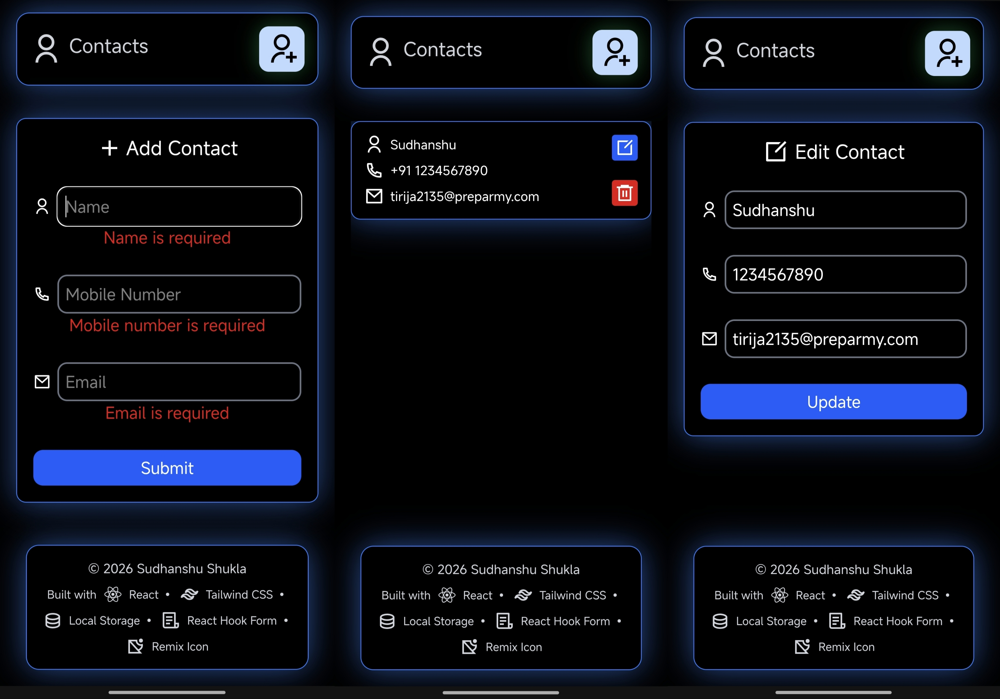

# 📇 React Contact Manager

A modern and responsive Contact Manager application built with **React**. React Contact Manager allows users to add, edit, and delete contacts with real-time form validation while securely storing data in Local Storage for a seamless user experience.

## 🌐 Live Demo

https://sudhanshu-react-contact-manager.pages.dev/

## 📸 Preview

  

  Mobile Preview

## ✨ Features

* ➕ Add New Contacts
* ✏️ Edit Existing Contacts
* 🗑️ Delete Contacts
* ✅ Real-Time Form Validation
* 💾 Local Storage Persistence
* 📱 Responsive Design
* 🎨 Modern UI with Tailwind CSS
* ⚡ Fast & Interactive User Experience
* 🎯 Clean Interface with Remix Icons

## 🛠️ Tech Stack

* React
* React Hook Form
* Tailwind CSS
* JavaScript (ES6+)
* Local Storage API
* Remix Icons

## 🎯 Skills Demonstrated

* React Components
* React Hooks (`useState`)
* Props Management
* Form Handling
* React Hook Form Validation
* CRUD Operations
* Local Storage Integration
* Conditional Rendering
* Responsive UI Design

## 🚀 Future Improvements

* 🔍 Search Contacts
* 📂 Filter & Sort Contacts
* ⭐ Favorite Contacts
* 🖼️ Profile Picture Support
* ☁️ Backend Integration (Node.js & MongoDB)
* 🔐 User Authentication
* 📤 Import & Export Contacts

## 👨‍💻 Author

**Sudhanshu Shukla**

[GitHub](https://github.com/ErSudhanshuShukla) | [LinkedIn](https://www.linkedin.com/in/ErSudhanshuShukla)
